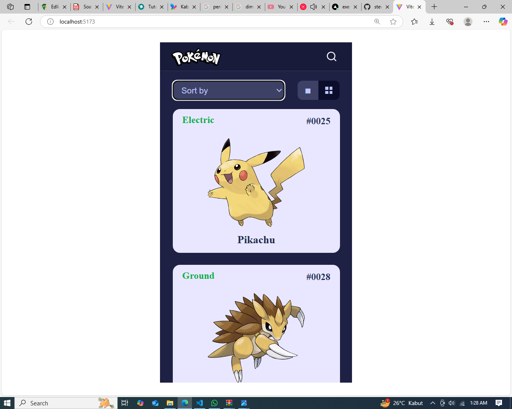

Exercise 5

Link repository and README this project :  https://github.com/sentotAB/exercise-5-pokemon-web-by-sentot-ab.git

Implementation git commands             :  
  
                                           git init 

                                           git add .

                                           git remote set-url origin https://github.com/sentotAB/exercise-5-pokemon-web-by-sentot-ab.git

                                           git push -u origin main

Implementation React Hooks              :  ............. on progress

Best practices that used in class       :  ............. on progress

Link Medium article                     :  ............. on progress

Result                                  :

